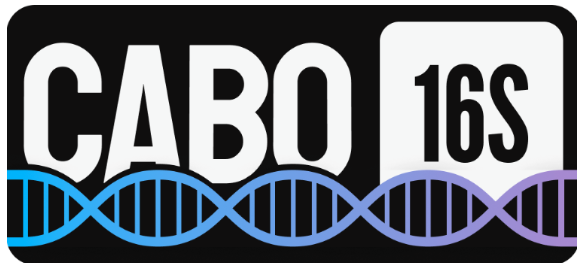

\
\
CABO-16S – A Combined Archaea, Bacteria, Organelle 16S database for amplicon analysis of prokaryotes and eukaryotes in environmental samples\
\
Eryn M. Eitel, Daniel Utter, Stephanie Connon, Victoria J. Orphan, Ranjani Murali\
\
Abstract\
Identification of both prokaryotic and eukaryotic microorganisms in environmental samples is currently challenged by either the burden of additional sequencing required to obtain both 16S and 18S rRNA sequences or the introduction of multiple biases induced by the use of “universal” primers. Organellar 16S rRNA sequences are automatically amplified and sequenced along with prokaryote 16S rRNA, and may provide an alternative method to identify eukaryotic microorganisms. CABO-16S combines bacterial and archaeal sequences from the SILVA database with 16S rRNA sequences of plastids and other organelles from the PR2 database to enable identification of all 16S rRNA sequences. Comparison of CABO-16S with SILVA 138.2 results in equivalent taxonomic classification of mock communities and increased classification of diverse environmental samples. In particular, identification of phototrophic eukaryotes in shallow seagrass environments, marine waters, and lake waters was increased. CABO-16S also provides the framework to add curated datasets of specialized sequences for further classification of clades which are not currently included in other databases. Addition of sequences obtained from Sanger sequencing of methane seep sediments and curated sequences of the polyphyletic SEEP-SRB1 clade resulted in differentiation of syntrophic and non-syntrophic SEEP-SRB1 in hydrothermal vent sediments. Such additions may simplify analysis of communities contributing to the anaerobic oxidation of methane, and highlight the potential benefit of amending existing training sets with curated sequences when studying extreme or unique environments underrepresented in existing databases.
